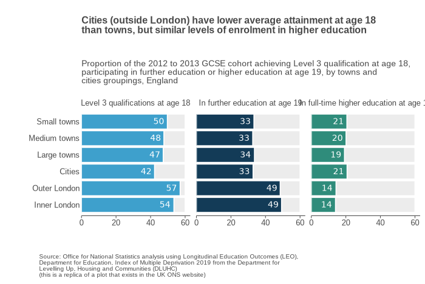

# 🧑‍🏫 Week 10 Analysis (LSE DS105A 2024/25)

🗓️ <strong>DATE:</strong> 5 December 2024  
⌚ <strong>TIME:</strong> 16.00-18.00  
📍 <strong>LOCATION:</strong> CLM.5.02

**AUTHOR:** Dr. [Jon Cardoso-Silva](https://jonjoncardoso.github.io)  
**DEPARTMENT:** [LSE Data Science Institute](https://lse.ac.uk/dsi)

> **Educational Notice:** This page demonstrates data visualisation and web publishing techniques for LSE DS105A students. Here I reproduce content from the UK Office for National Statistics (ONS) article ["Why do children and young people in smaller towns do better academically than those in larger towns?"](https://www.ons.gov.uk/peoplepopulationandcommunity/educationandchildcare/articles/whydochildrenandyoungpeopleinsmallertownsdobetteracademicallythanthoseinlargertowns/2023-07-25) (July 2023) as an educational tool to demonstrate how to host markdown-rendered pages via GitHub Pages.

---

... (_in a real project page, there would be stuff preceding this analysis, of course_)...

## Around a third of young people from towns of all sizes enter higher education

There was little difference in the average percentage of young people who entered higher education between towns of different sizes. A third (33%) of young people in our cohort from small and medium sized towns went to higher education on average, compared with 34% from large towns.

In cities (outside of London), attainment by age 18 years was lower than in small, medium and large towns, with a smaller proportion of students holding two A levels or equivalent qualifications. Despite this, attendance at higher education was similar for pupils in cities and towns.

This could reflect easier access to university and other further education opportunities, with pupils in cities perhaps less likely to face the financial burden of moving away from home to study. This may also partially explain why pupils from Inner London were the most likely to go on to higher education.

